# Отчётный дневник: Спринт 2 — Issues, Angular 22 и подготовка к интервью

> **Период:** Спринт 2  
> _Жанр: техническая хроника с элементами самоиронии_

---

## 📑 Оглавление

- [Вступление](#вступление)
- [Закрытые Issues](#закрытые-issues)
  - [Footer](#footer)
  - [Routing](#routing)
  - [Header TabBar](#header-tabbar)
  - [PokeApi Interface](#pokeapi-interface)
  - [Auth Guard](#auth-guard)
  - [Login Form Service](#login-form-service)
  - [Pokemons Storage Service и Filter Component](#pokemons-storage-service-и-filter-component)
- [Миграция на Angular 22](#миграция-на-angular-22)
- [Подготовка к интервью](#подготовка-к-интервью)
- [План на 3-й спринт](#план-на-3-й-спринт)
- [Заключение](#заключение)

---

## Вступление

Прэвет, Танди! 👋 Как оно? Давно не виделись.

Я хотел было писать дневник раз в неделю, но был очень ~~ленив~~ занят, потому пишу один — да и тот в конце спринта. И что самое мозговыносящее — я пишу его даже не ночью! Чувствуется прогресс, да? 🌙️☀️

Как и в прошлый раз, буду тренировать слепую печать и записывать всё, что мы делали в рамках спринта. Так же прорекламирую прошлый дневник-гайд для тех, кто его не видел — это был эксперимент с моей стороны, как его воспримешь ты, Танди.

В этом цикле важных теледневниковых передач я расскажу:

- Чем я занимался в рамках 2-го спринта
- Как мы готовились к интервью
- О миграции на 22 Angular
- О планах на следующий спринт

И самое трудное, что мне предстоит сделать — это вообще вспомнить, что я делал в эти две недели. Так-то у меня оперативка всего на 512 МБ, так что я могу не вспомнить некоторые детали. 🧠💾

Штош, поехали! 🚀

---

## Закрытые Issues

Во втором спринте, кроме составления самих issue, я закрыл **8 issues**:

### Список закрытых задач

| №   | Issue                                                                       | Описание                 |
| --- | --------------------------------------------------------------------------- | ------------------------ |
| 1   | [#28](https://github.com/ngKittyDebug/angular-ngKittyDebugLeft/issues/28)   | Footer                   |
| 2   | [#47](https://github.com/ngKittyDebug/angular-ngKittyDebugLeft/issues/47)   | Routing                  |
| 3   | [#55](https://github.com/ngKittyDebug/angular-ngKittyDebugLeft/issues/55)   | Header TabBar            |
| 4   | [#57](https://github.com/ngKittyDebug/angular-ngKittyDebugLeft/issues/57)   | FIlter component         |
| 5   | [#68](https://github.com/ngKittyDebug/angular-ngKittyDebugLeft/issues/68)   | PokeApi Interface        |
| 6   | [#101](https://github.com/ngKittyDebug/angular-ngKittyDebugLeft/issues/101) | Login Form Service       |
| 7   | [#102](https://github.com/ngKittyDebug/angular-ngKittyDebugLeft/issues/102) | Pokemons Storage Service |
| 8   | [#103](https://github.com/ngKittyDebug/angular-ngKittyDebugLeft/issues/103) | Auth Guard               |

Опишу о каждом по порядку. Некоторые issue были весьма простые, о которых нечего даже рассказывать, иные были поинтереснее. Потому на некоторых я не буду сильно акцентировать внимание, а на других напишу подробнее.

---

### Footer

**Issue:** [#28](https://github.com/ngKittyDebug/angular-ngKittyDebugLeft/issues/28)

Простая задача — всего лишь добавить новый компонент `footer` в layout приложения. В самом футере две ссылки: на **About** и **GitHub** проекта.

Собственно, ничего интересного. ➡️

---

### Routing

**Issue:** [#47](https://github.com/ngKittyDebug/angular-ngKittyDebugLeft/issues/47)

Также простая задача — просто добавить существующие страницы в роуты. Сделаны они были с ленивой загрузкой.

Единственное, что я могу отметить — насколько мне показалось удобным я сделал роутинг. Может, это кажется оверинжинирингом, но я покажу на скриншотах.

#### Структура роутинга

| Описание                                                              | Скриншот                                                                 |
| --------------------------------------------------------------------- | ------------------------------------------------------------------------ |
| Папка `features` со всеми страницами и корневым `features.routes`     | 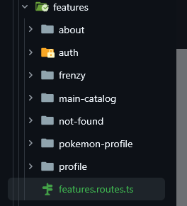 |
| Импорт в `features.routes`                                            | 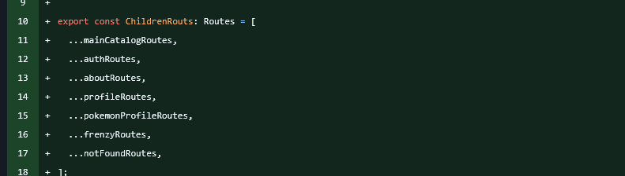       |
| Layout с ленивой загрузкой дочерних элементов в корневом `app-routes` | 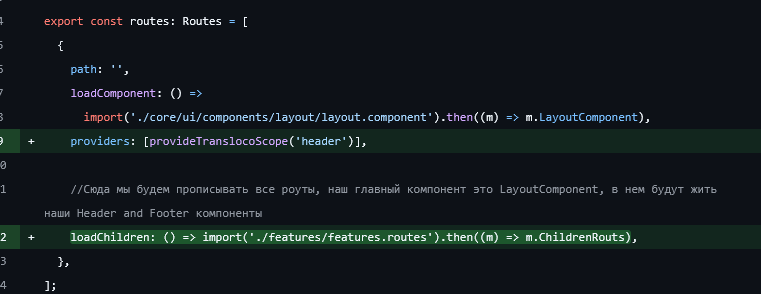           |
| Пример feature с собственным роутом                                   | 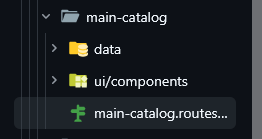    |
| Пример того что будет импортировано в `features.routes`               | 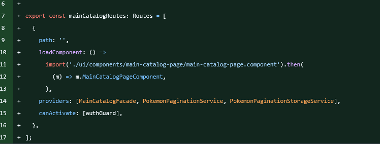  |

#### Преимущества такого подхода:

✅ Достаточно удобно расположили роуты — у каждого свой файл  
✅ Если нужно что-то поменять или дополнить провайдеры, гварды и т.д. — нет нужды лезть в корневой `app.routes`  
✅ Помогает избежать большого количества merge-конфликтов, если нескольким участникам нужно поправить что-то в своих компонентных роутах  
✅ Конфликт может возникнуть только в самом `ChildrenRoutes`, да и то — всего в пару строк  
✅ Всегда понятно, что роуты будут только добавляться, потому можно быстро понять, что происходит в этом файле

---

### Header TabBar

**Issue:** [#55](https://github.com/ngKittyDebug/angular-ngKittyDebugLeft/issues/55)

Я с гордостью хотел было приступить к написанию бургер-меню, но меня жестоко остановили и сказали, что теперь **burger не в моде**, что повергло меня в кризис среднего возраста. 😱 Вместо этого мне предложили добавить **TabBar**, как для мобильных приложений.

Ну, коли так — взялся за дело.

Сам `TabBar` я взял из **Taiga UI** — библиотеки, которую мы используем. Посему про него рассказывать нечего.

#### Проблема адаптивности

Для начала мне нужно было понять:

- По какому принципу будет скрываться nav-меню в header
- Как будет появляться TabBar

Понятное дело, можно это решить через классические CSS media queries, но это же будет скучно и не по-ангуляровски, да? 🤔

#### Решение: кастомная структурная директива

Я решил сделать кастомную **директиву**, которая будет скрывать/показывать элемент.

У нас есть два варианта использования:

1. **Атрибутная** — взаимодействует с классами, data-атрибутами и т.д.
   - Скучно, тем более — чем это будет отличаться от CSS queries? Тем, что они идут через директиву? Ну, такое... 😐

2. **Структурная** — интереснее!
   - Буду удалять компонент или добавлять компонент при изменении ширины экрана ✅

#### Изучение структурных директив

По документации Angular про кастомные структурные директивы вычитал про эти рефы:  
📖 [Angular Structural Directives](https://angular.dev/guide/directives/structural-directives#one-structural-directive-per-element)

| Ref                  | Описание                                                                                                                                                                                                                                                                 |
| -------------------- | ------------------------------------------------------------------------------------------------------------------------------------------------------------------------------------------------------------------------------------------------------------------------ |
| **ViewContainerRef** | Если грубо говорить — это ссылка на элемент, на котором висит наша структурная директива. Благодаря ей мы можем как очищать контейнер, так и добавлять новые элементы. Также `ViewContainerRef` умеет принимать классовый компонент и создавать его.                     |
| **TemplateRef**      | Это ссылка на то, что будет внутри компонента, на котором захостилась директива. Благодаря этому рефу мы можем помещать любые компоненты внутри или же удалять их из DOM. Сами компоненты могут быть любыми: хоть отдельный компонент страницы, хоть небольшие элементы. |

#### Отслеживание изменений экрана: BreakpointObserver

Далее мне нужно было понять: как отследить изменения размера экрана?

Немного погуглив, нашёл **BreakpointObserver**, который предоставляет Observer и позволяет отслеживать размеры экрана. Но самое тупое — что в самой ангуляровской документации я не смог найти его! В самой доке он вёл на Angular Material:

| Скриншоты из документации                                                    |
| ---------------------------------------------------------------------------- |
| 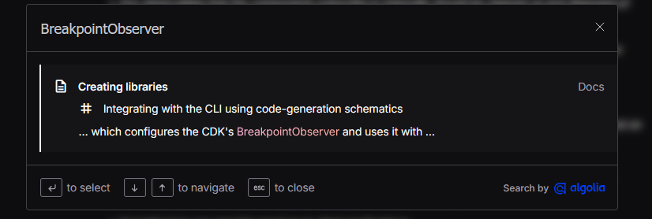 |
| 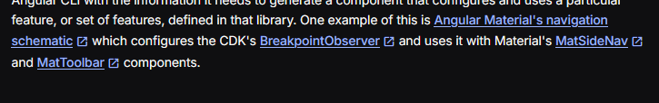 |
| 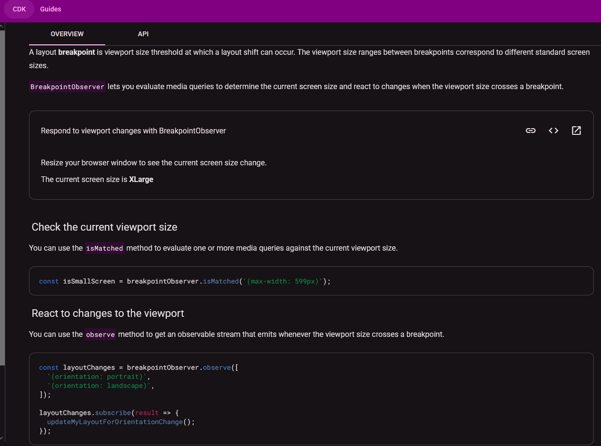 |

При том, что Material у нас нет, но есть CDK. Лучше бы она была в офф-доке, хотя, может, она и сторонняя.

BreakpointObserver ещё предоставлял готовые breakpoints, что я хотел использовать, но потом отказался от этой идеи.

#### Реализация

Я завёл `input` signal с алиасом, который принимал в себя breakpoints по типу из Breakpoints.

Далее — простые проверки: если то — то это, если не это — то то. Короче, вы поняли. 🤷‍♂️

**Проблема:** Поначалу оно работало не так, как задумывал. Сама директива работала только после перезагрузки страницы — то есть отрабатывала только один раз и не следила за изменением ширины экрана. Так-то никто не будет насильно менять размер экрана, но мне было мало — я хотел, чтобы она работала даже тогда, когда ты расширяешь или уменьшаешь экран.

**Костыльное решение:**

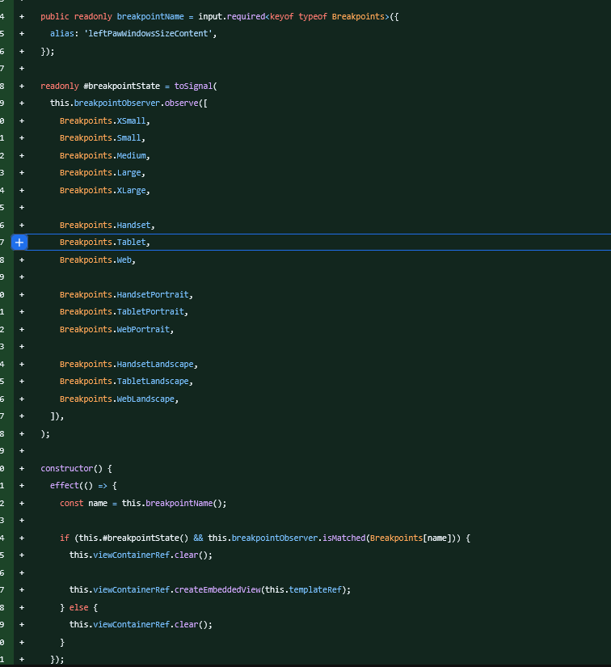

По нему видно, что вариант такой себе:

- Идёт через нежелательный `effect`
- Используется `this.#breakpointState()`, который тупо ничего не делает, но без него `effect` не работает

Далее Сасарик сказал: "Так как это Observer, тогда сделаем через подписки". И впоследствии я полностью отказался от готовых breakpoints — они больше мешали, чем помогали.

#### Финальный вариант директивы

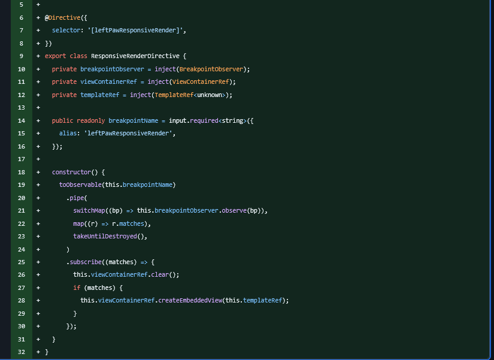

Намного проще и понятнее! А сам он используется вот так:

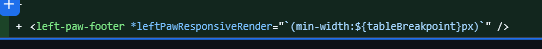

В качестве строки просто передаём размер и сам breakpoint в пикселях (тут у меня константа). Просто и понятно, и теперь её может использовать любой участник команды, если захочет скрывать какой-либо элемент. ✅

---

### PokeApi Interface

**Issue:** [#68](https://github.com/ngKittyDebug/angular-ngKittyDebugLeft/issues/68)

Простое написание интерфейсов на будущие запросы, дабы упростить будущие issue. Не больше, не меньше. 📝

---

### Auth Guard

**Issue:** [#103](https://github.com/ngKittyDebug/angular-ngKittyDebugLeft/issues/103)

Также простые задачи — сделал два guard'а:

- Для гостя
- Для зарегистрированного пользователя

Просто не пускает на страницы и перенаправляет. Запихиваем в роуты, например, в `canActivate`:

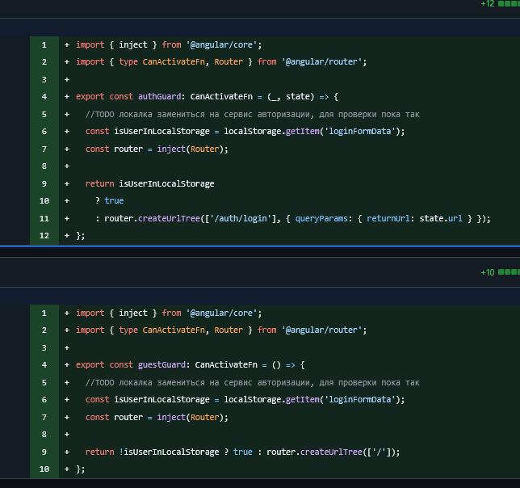

Простые и тупые. Единственное — для `AuthGuard` мне подсказали добавить **обратную ссылку**: когда пользователь, например, залогинится или зарегистрируется — перенаправить на обратную ссылку, на которой пользователь пытался зайти.

---

### Login Form Service

**Issue:** [#101](https://github.com/ngKittyDebug/angular-ngKittyDebugLeft/issues/101)

Простая реактивная форма. Поначалу я хотел сделать и для страницы регистрации, но Павел захотел попробовать использовать **сигнальную форму** — ну и почему бы и нет? 🤷‍♂️

- Вывел форму в отдельный сервис
- Сделал две функции валидации
- Добавил на страницу

Всё, легко и понятно! Для реактивной формы ничего сложного, при том что у меня всего было два поля:

| Валидация 1                                                           | Валидация 2                                                           |
| --------------------------------------------------------------------- | --------------------------------------------------------------------- |
| 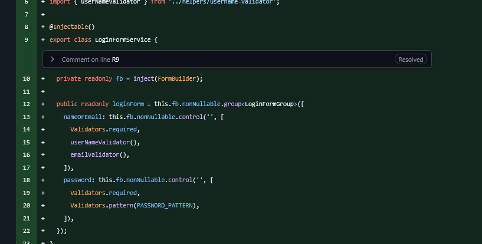 | 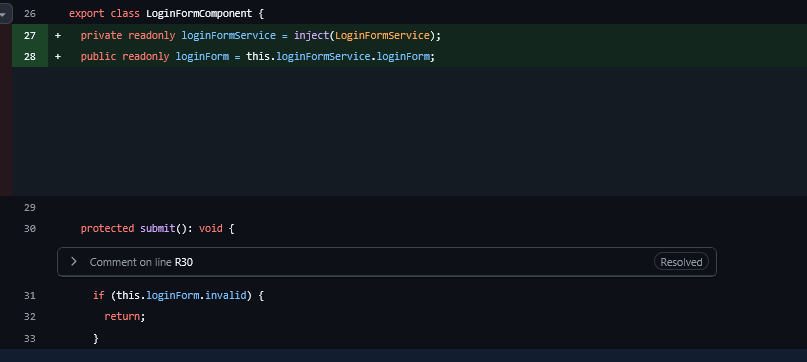 |

Скучно, просто, понятно. Мне потом рассказали, что было в сигнальной форме — с ней было поинтереснее.

---

### Pokemons Storage Service и Filter Component

**Issues:** [#57](https://github.com/ngKittyDebug/angular-ngKittyDebugLeft/issues/57), [#68](https://github.com/ngKittyDebug/angular-ngKittyDebugLeft/issues/68)

Почему сразу два issue? Они закрылись сами собой во время разработки сервиса, чего, конечно, я не предполагал, но всё же закрыл. Так же ещё закрыл ещё задачу, о которой не писал в issue и даже не думал, что закрою тут же.

Если вкратце:

- ✅ Сделал сервис запросов к покемонам
- ✅ Сервис-хранилище покемонов с пагинацией
- ✅ Сервис для пагинации покемонов
- ✅ Простой фильтр-компонент по имени
- ✅ Компонент пагинации

Я начал с того, что нужно было разобраться:

- Что конкретно я хочу хранить в сервисах
- Какие мне для этого будут нужны методы
- Как мне их использовать
- Как мне получать данные и стучаться в API покемонов

**Спойлер:** Сама PokeAPI оказалась очень объёмной и интересной, но в тоже время очень неудобной для получения данных. К примеру, у неё нет query-параметров для фильтров всех покемонов по какому-то критерию (например, по типу или по поколению). 😤

#### PokemonApiService

Первый сервис, где я буду делать методы для запросов к PokeAPI.

Пока первый метод — это запрос покемонов:

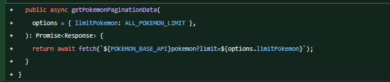

В этом запросе мы получаем данные для пагинации:

- Общее количество покемонов
- URL для запросов на следующие 20 покемонов
- URL для возврата на предыдущих покемонов (если они были)
- Блок `results`, где был массив покемонов (объект с именем покемона, а также URL к нему)

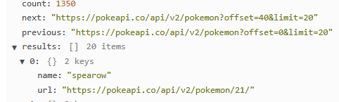

Окей, готово, запросы есть! Следующий этап — это сам запрос и получение JSON для дальнейшего использования.

#### PokemonPaginationStorageService

В нём я делаю уже запрос и получаю данные для пагинации:

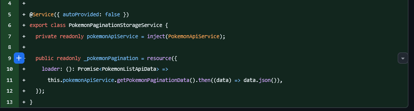

Для запроса использую **resource** — невероятно крутой сигнал, в котором много функционала! Он даёт возможность отслеживать статус загрузки, сами статусы и ещё много чего интересного.

В нём же есть `params`, в который можно передать сигнал, и потом передать этот `params` в `loader`. Каждый раз, когда срабатывает сигнал в `params`, срабатывает `loader` и делается новый запрос. Сам же `resource` хранит предыдущие состояния до тех пор, пока успешно не получит данные и перезапишет их.

Поначалу я хотел с помощью сигнала отправлять запросы и получать разных покемонов через `offset` query-параметр, но позже пришлось отказаться от этой идеи — потому что я бы не смог нормально фильтровать всех покемонов по именам.

**Решение:** Я сделаю по старту приложения всего один запрос, который получит полностью всю пагинацию — то есть всех 1300+ покемонов. Сам JSON хранит всего массив, в котором в объекте всего два поля. Дёшево и сердито. 💰

#### PokemonPaginationService

Теперь самый важный сервис, который строит всю пагинацию:

- Даёт возможность отслеживать состояние
- Выводит методы переключения пагинации
- Реализует фильтрацию

**Первое:** вытащил данные из `resource` сигнала:

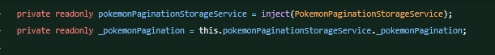

Вытащил состояние и значения:

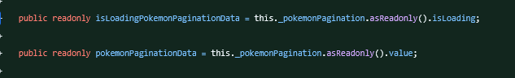

Ну и сделал только для чтения (readonly).

**Далее:** тут мы уже начинаем фильтровать данные по именам:

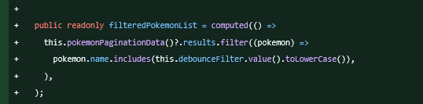

Как тут видно, использую `computed` для пересчитывания значения. Срабатывает он от `debounceFilter`.

Сам `debounceFilter` срабатывает от сигнала и даёт задержку при вводе, дабы не было миллиона запросов:

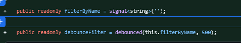

**Далее:** вытащил количество покемонов и вычислил, сколько всего страниц:

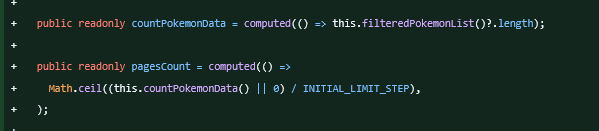

Тут на основе фильтра нарезаем массив для пагинации — по 20 покемонов на страницу:

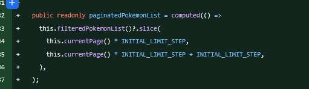

Ну и сам метод для смены страниц:

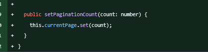  
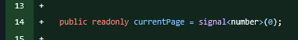

При `set` нового значения переключаются страницы.

#### Компоненты

Ну и далее я добавил два компонента: с пагинацией и фильтром:

| Filter Component                                                  | Pagination Component                                                  |
| ----------------------------------------------------------------- | --------------------------------------------------------------------- |
| 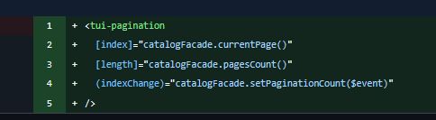 | 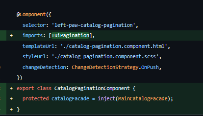 |
| 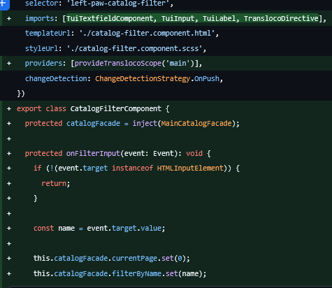 | 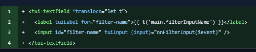 |

Тут, думаю, ничего пояснять не нужно — всё тут довольно-таки просто.

#### Финальный штрих

Ну и последний штрих — сами запросы к покемонам. У нас уже был готовый компонент карточки, который при создании получает имя покемона и делает запрос на него, и карточка отрисовывается. Я просто заменил моковый запрос на настоящий — и всё заработало полностью! Теперь у нас карточки строятся на основе настоящего API, а не моков. 🎉

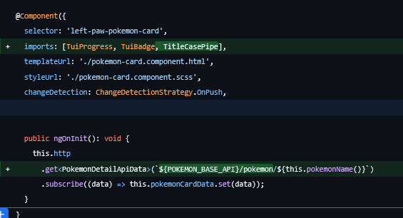

Ну и ещё добавил `@defer` для карточек

**Итог:** Всё, что я предполагал, было сделано и работает. Сделал даже чуть больше, чем рассчитывал — правда, тут всего-то пару методов и пару компонентов переписать, было не супер сложно. ✅

---

## Миграция на Angular 22

Вы могли заметить, что я использовал какие-то возможности, например:

- `resource` (который должен быть экспериментальным)
- Какой-то ещё `debounce`
- `@Service({ autoProvided: false })`

Вы можете спросить: **"Что за фигня? Я такое в первый раз вижу!"** 🤯

А я скажу: **Добро пожаловать в Angular 22!** 🎊

Где теперь:

- ✅ Сигнальные формы
- ✅ Resources
- ✅ И куча много другого

...вышли из экспериментального режима!

В 22 Angular добавили очень много классных возможностей, о которых вам стоит почитать.

### Самые крутые нововведения:

| Фича                                | Описание                                                                                                    |
| ----------------------------------- | ----------------------------------------------------------------------------------------------------------- |
| **Resource**                        | Новый мощный сигнал для работы с асинхронными данными                                                       |
| **@Service декоратор**              | Улучшенная работа с сервисами                                                                               |
| **Spread operator в темплейтах**    | Теперь можно использовать `...` прямо в шаблонах                                                            |
| **Стрелочные функции в темплейтах** | Arrow functions теперь доступны в шаблонах                                                                  |
| **ChangeDetectionStrategy.OnPush**  | Теперь работает по умолчанию! 🚀                                                                            |
| **Error Boundary**                  | Эта штука перехватывает ошибки в компонентах в темплейте, и если перехватил — отрисовывает другой компонент |

📖 **Короче, [почитайте](https://blog.angular.dev/announcing-angular-v22-c52bb83a4664)!**

### Процесс миграции

Сама миграция прошла в несколько этапов:

1. Нужно было загрузить новую версию Node.js: **v24.15.0**
2. Прописали пару команд — они сами всё сделали ✨

Также в самом Angular есть страница, где написаны все команды и инструкция к апдейту:  
🔗 [Angular Update Guide](https://angular.dev/update-guide)

---

## Подготовка к интервью

**Или: "Интересное тамада с розыгрышем призов в виде вопроса"** 🎯

У нас с одной организации 6 студентов, которые поделены на команды и работают над своими проектами. НО так же мы часто вместе созваниваемся или просто разговариваем о том о сём.

Ну, мы и вместе решили подготовиться к интервью! 💼

### Первый прогон

Просто прочитка и повторение/изучение того, что было предложено в документе. В этом этапе не было ничего интересного. 😴

### Второй прогон: Шоу!

Но во втором мы решили сделать из этого интересное шоу (записи, думаю, добавлю позже):

**Формат:**

- 🎡 Розыгрыш вопросов — вопросы выбирались путём выкручивания колеса
- 🎡 Колесо было и для студентов, которые должны были отвечать
- 📉 Каждый раз, когда студент отвечал, его вес и шанс выпасть на колесе уменьшался
- ❓ Вопрос, на который ответили, удалялся из пула вопросов

**Результат:**
Такой формат вопросов-ответов был:

- ✅ Максимально интересный
- ✅ Не стрессовый
- ✅ Очень весёлый

Думаю, на 3-й спринт повторим такой же формат! 🎉

---

## План на 3-й спринт

Из всего, что я понял — нам нет смысла ждать 3-4 спринта, чтобы кодить то, что в них нужно. К примеру, только в 4-м спринте предлагается подключать API HttpClient, что я считаю самым уж натянутым. 🤨

Я почикал по нашему проекту — мы почти всё уже закрыли для 3-го спринта, и немного для 4-го осталось.

### Что будем делать:

**На следующий спринт:**

1. ✅ Закроем всё, что осталось для 3-го и 4-го спринтов
2. ✅ Будем уже делать то, что мы хотели изначально — **Тамагочи** 🎮
3. ✅ Улучшения текущих страниц и фич

### Мои личные задачи:

- 📝 Буду расписывать новые issue
- 🔌 Буду подключать бэк для авторизации, регистрации и т.д.

**В качестве бэка** я возьму свой старый, который мы использовали в прошлом проекте. Я его модифицирую под текущий проект:

- Достаточно будет взять только модуль авторизации
- Обновлю CORS для работы с новым API
- Нам пригодится ещё профиль — я его так же модифицирую, добавлю новые поля

Ну и чтоб не было вопросов — я так же писал его на **NestJS**. Можно было бы, конечно, написать ещё сервер, но зачем? Когда можно переиспользовать старый! 🔄

**Ещё одна проблема:** сервер я хощу на Render, где разрешён всего один проект. Потому доработка старого сервера будет намного лучше. Да и вспомню, и посмотрю, что я писал под другим углом. 👀

---

## Заключение

Ну и, собственно, вроде всё. Это всё, чем я занимался на этом 2-м спринте.

Надеюсь, ничего такого не забыл — всё же память уже не та. 🧓

Давай, Танди, до встречи! Прорекламируй меня, как в прошлый раз, на весь RS! 📢

> ⏱️ **Затраченное время на написание дневника:** ~5 часов (±)

---
