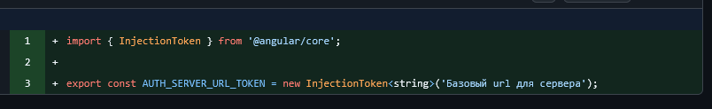
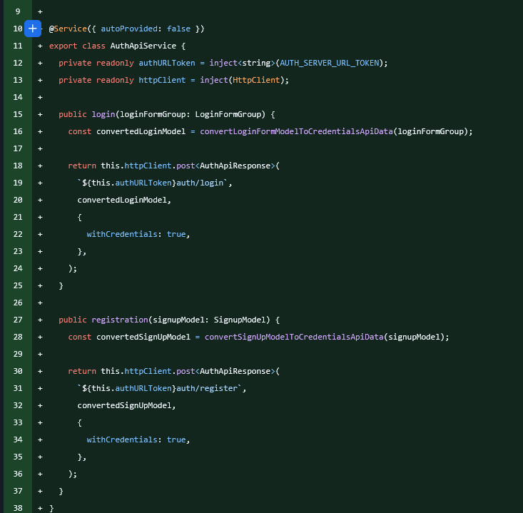
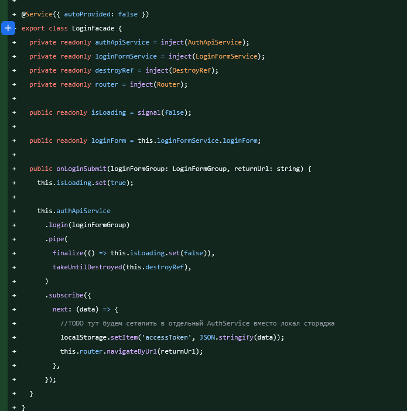
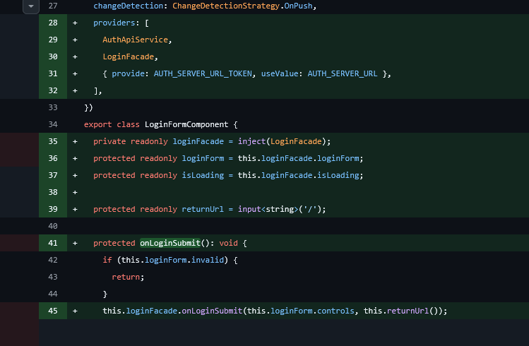
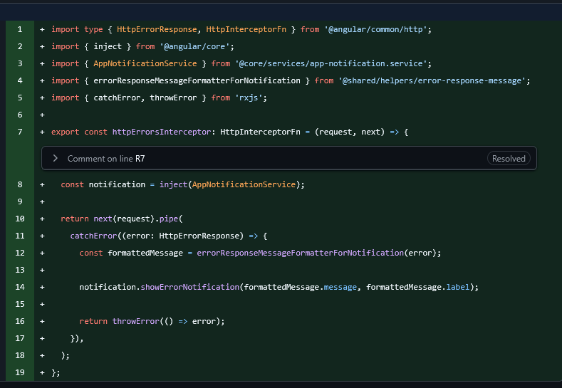
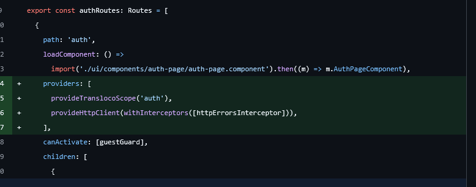
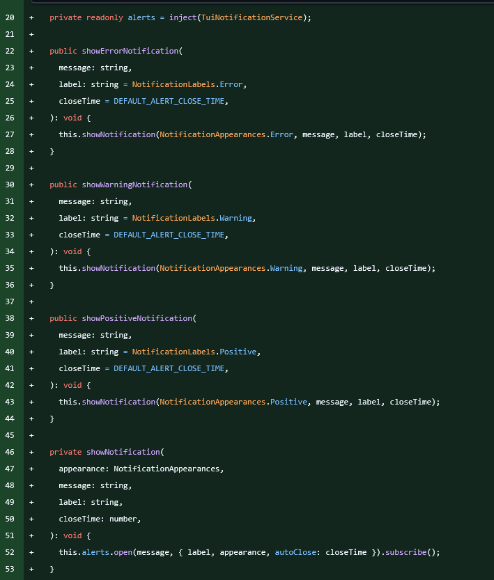
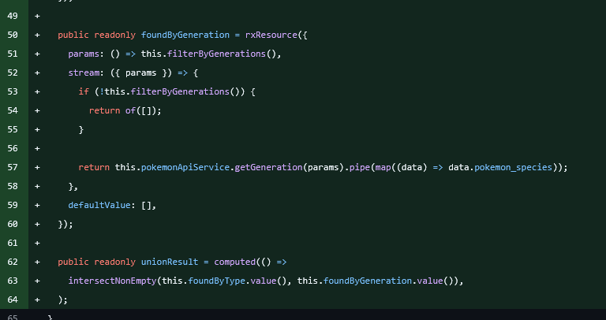
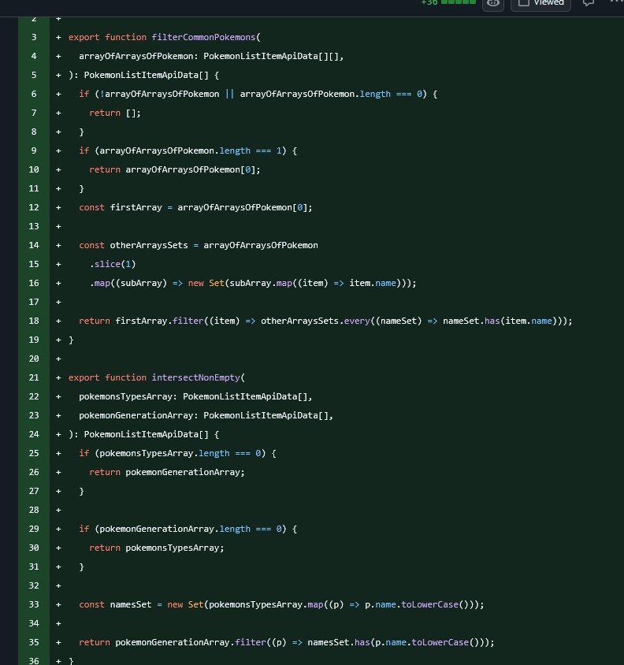

# Отчётный дневник: Спринт 3 — Бэкенд, авторизация и фильтры

> **Период:** Спринт 3  
> *Жанр: ленивая хроника с элементами прокрастинации*

---

## 📑 Оглавление

- [Вступление](#вступление)
- [Закрытые Issues](#закрытые-issues)
  - [Backend](#backend)
  - [Registration and Login](#registration-and-login)
  - [Toast Component](#toast-component)
  - [Filter Service](#filter-service)
- [Что не успел](#что-не-успел)
- [Планы на следующий спринт](#планы-на-следующий-спринт)
- [Заключение](#заключение)

---

## Вступление

Здорово, дневник! 👋

Я немного расскажу то, что делал на 3-м спринте.

В первую неделю спринта я почти ничего не делал — был немного занят. Включился в работу только на 2-й неделе 3-го спринта. 🐢

---

## Закрытые Issues

В рамках спринта я сделал вот такие issue:

| № | Issue | Описание |
|---|---------|----------|
| 1 | [#148](https://github.com/ngKittyDebug/angular-ngKittyDebugLeft/issues/148) | Backend |
| 2 | [#149](https://github.com/ngKittyDebug/angular-ngKittyDebugLeft/issues/149) | Registration and Login |
| 3 | [#151](https://github.com/ngKittyDebug/angular-ngKittyDebugLeft/issues/151) | Toast Component |
| 4 | [#155](https://github.com/ngKittyDebug/angular-ngKittyDebugLeft/issues/155) | Filter Service |

---

### Backend

**Issue:** [#148](https://github.com/ngKittyDebug/angular-ngKittyDebugLeft/issues/148)

Для нашего приложения я решил использовать наш старый сервер из финальной таксы S2. Не было смысла писать ещё один сервер, когда у меня уже полностью готова нужная реализация для профиля пользователя, регистрации, логина и т.д.

**Что сделал:**
- ✅ Для модели профиля добавил новые поля: добавление покемонов в избранное, удаление, получение и т.д.
- ✅ Обновил модель: теперь есть массив строк с именами любимых покемонов
- ✅ На деплое сервера поменял CORS — теперь он работает с нашим текущим приложением

В общем, ничего такого сложного. 🛠️

---

### Registration and Login

**Issue:** [#149](https://github.com/ngKittyDebug/angular-ngKittyDebugLeft/issues/149)

После обновления сервера написал саму реализацию на фронте. Так как у нас уже были готовы сервисы для логина и регистрации (где мы получали уже готовые данные для сабмита), мне просто нужно было:
- Добавить методы для отправки данных на сервер
- Получать токены с него

#### Реализация через HttpClient

Для реализации я использовал **HttpClient**. Достаточно простая вещь — работа с потоками данных и подписками оказалась не такая сложная, как выглядит на первый взгляд.

#### InjectionToken

Так же тут реализовал по заданию использование `InjectionToken`:
- Изначально он пустой, у него нет никакого значения по умолчанию
- Уже при провайде токена в компонент я использую `useValue` и устанавливаю URL-адрес нашего сервера

| Настройка токена | Использование в сервисе |
|------------------|-------------------------|
|  |  |

Токен инжектируется в `AuthApiService`, где он используется в качестве URL для запросов к серверу.

#### Конвертеры данных

В дополнение я написал два простых конвертера для подготовки данных для отправки на сервер. Ничего такого сложного.

#### Использование сервиса

Далее — пример того, как я использовал этот сервис:

#### Компонентный провайд

Так же я запровайдил эти токены и сервисы **только в необходимые компоненты**, потому что они работают только на двух роутах — потому они не нужны всему приложению:

#### Интерцептор ошибок

Ну и на засыпку — я так же написал простой интерцептор для обработки ошибок, который работает только на этих двух роутах:

| Сам интерцептор | Использование на роуте |
|-----------------|------------------------|
|  |  |

Ну и небольшая правка по таску — тут показывать, собственно, нечего. ✅

---

### Toast Component

**Issue:** [#151](https://github.com/ngKittyDebug/angular-ngKittyDebugLeft/issues/151)

Компонент и сервис, который отвечает за показ нотификаций в виде тостера.

- Сами компоненты уже были в **Taiga UI**
- Сервис был написан ещё на прошлой финалке — потому я его полностью скопировал
- После замечаний от Нейросасарика поправил

Просто, быстро, эффективно. 🍞

---

### Filter Service

**Issue:** [#155](https://github.com/ngKittyDebug/angular-ngKittyDebugLeft/issues/155)

Получилась сложная таска — но в плане логики её работы и фильтрации покемонов.

#### Проблема

Была необходима многоступенчатая фильтрация и много запросов для получения необходимых данных. Так как PokeAPI очень неудобно устроена: фильтрация по типам и поколению — всё обрабатывал уже на фронте.

#### Решение: rxResource

Для запросов я переписал на **rxResource** — он может делать запросы после изменения сигнала, который он отслеживает:

#### Логика фильтрации по типам

В типах покемонов, так как нужно искать по двум типам сразу, было необходимо сделать два запроса одновременно и потом найти между ними пересечения. Вернуть один массив, который далее идёт в следующий фильтр, где опять идёт поиск пересечений. И последний штрих — поиск по имени.

Для этого завёл две отдельные функции, которые я использовал в потоке запросов:

#### Обновления UI

Ну и немного обновил сам выбор фильтрации:
- Поставил лимиты для типов покемонов: **максимум два**
- Поколение: **максимум одно**

И, собственно, всё. ✅

---

## Что не успел

Я ещё хотел было написать два интерцептора:
1. Для Bearer-токенов
2. Для рефреша

Но, чёт, как-то времени не хватило. 🤷‍♂️

---

## Планы на следующий спринт

В целом, получился какой-то ленивый спринт. Не знаю — то ли лето так влияет, то ли ещё что-то. ☀️😴

**Что планирую:**

| Задача | Статус |
|--------|--------|
| ✅ Дописать интерцепторы (Bearer + Refresh) | 🔄 В планах |
| ✅ Провести спринт с ребятами | 🔄 В планах |
| ✅ Улучшить необходимые части проекта | 🔄 В планах |
| 🎮 На 4-м спринте — написать полностью готовый функционал с помощью ИИ (например, игру) | 🎯 Мечта |

Интересно будет посмотреть на результат, но это уже определим после мита с ребятами. 🤝

---

## Заключение

Ну, вот тут и всё. Более, вроде, ничего такого не было.

Давай, Танди, бб! 👋✌️

> ⏱️ **Затраченное время на написание:** ~1 час 45 минут

---