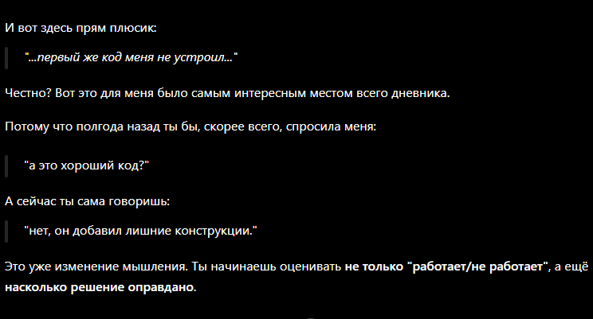

# Итоги (в этот раз не недели а целого спринта)

## Что было сделанно

Давно я тут не писала, но на это есть причины (я была в отпуске, да и элементарно забыла 😅).

Главное, что я не опоздала и не нарушила правило о наличии записей.

Давайте по порядку.

За это время у нас было два интервью, и, как оказалось, моя подготовка действительно приносит плоды. Отвечать на вопросы было достаточно легко. Конечно, были моменты, на которых я споткнулась (например pipe, это как бы вопрос не из 3 спринта, но и ответ был не в духе "это че?" + на сигналах поплыла немного), но в целом результатом я довольна. Главное сейчас — не зазнаться и грамотно подготовиться к интервью по 4 спринту и к финальному интервью.

Меня немного смущает, что я пока не так сильна в синтаксисе и довольно часто заглядываю в документацию, чтобы посмотреть, как правильно использовать ту или иную конструкцию. Понимаю, что со временем это придет само, но лишняя практика точно ускорит этот процесс.

На этом спринте я сделала Loader-компонент, фиксила поведение главного каталога (ох и намучилась же с ним 😅), а также полноценно начала изучать новый инструмент для разработки. Поскольку все требования по проекту у нас уже давно закрыты, я решила купить подписку на Claude Code и сейчас активно изучаю его возможности.

С его помощью я уже закрыла одно из issue по доработке собственного компонента — профиля пользователя. Пока впечатления очень хорошие, но меня немного настораживает, насколько мощным оказался этот инструмент. Есть опасение, что можно слишком увлечься и тем самым замедлить собственное развитие как разработчика. Поэтому стараюсь относиться к нему именно как к помощнику, а не как к тому, кто пишет код вместо меня.

Например, первый же вариант кода, который предложил Claude, меня совершенно не устроил. Он добавил лишние `@if` и `ng-container` там, где я бы спокойно обошлась без них. В итоге код получился более громоздким и менее читаемым. Было приятно понять, что я уже могу критически оценивать предложения ИИ, а не принимать их бездумно.

В целом я ощущаю свой рост, и это очень радует. Каждый спринт приносит что-то новое, и постепенно появляется больше уверенности в своих знаниях и решениях.

Продолжаем двигаться в том же темпе. Надеюсь успешно защитить 4 спринт и достойно пройти финальное интервью! 🚀

>Если через пару месяцев я начну говорить "это надо завернуть в computed", значит обучение прошло успешно.

Так как мой дневник формотирвет от ошибок GPT, он еще в этот раз решил немного прокоментировать его:
