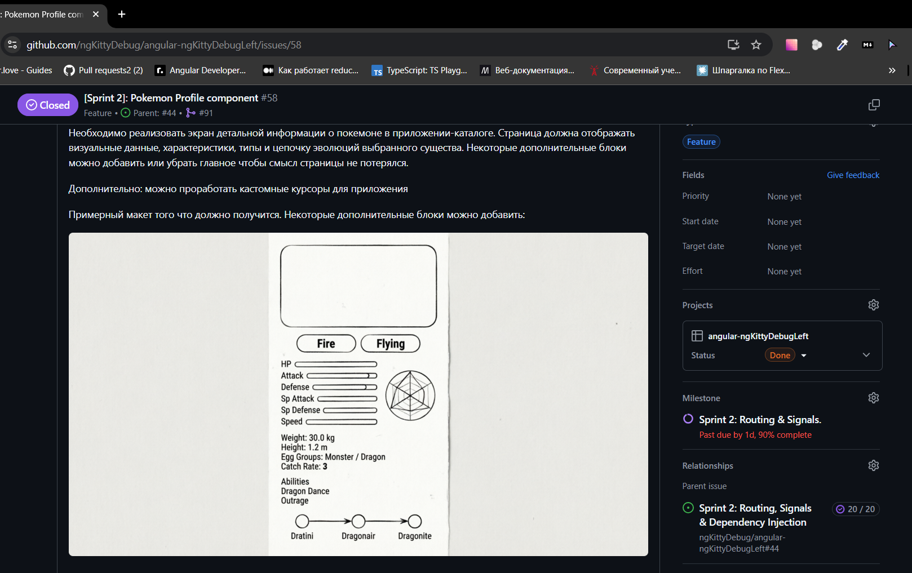
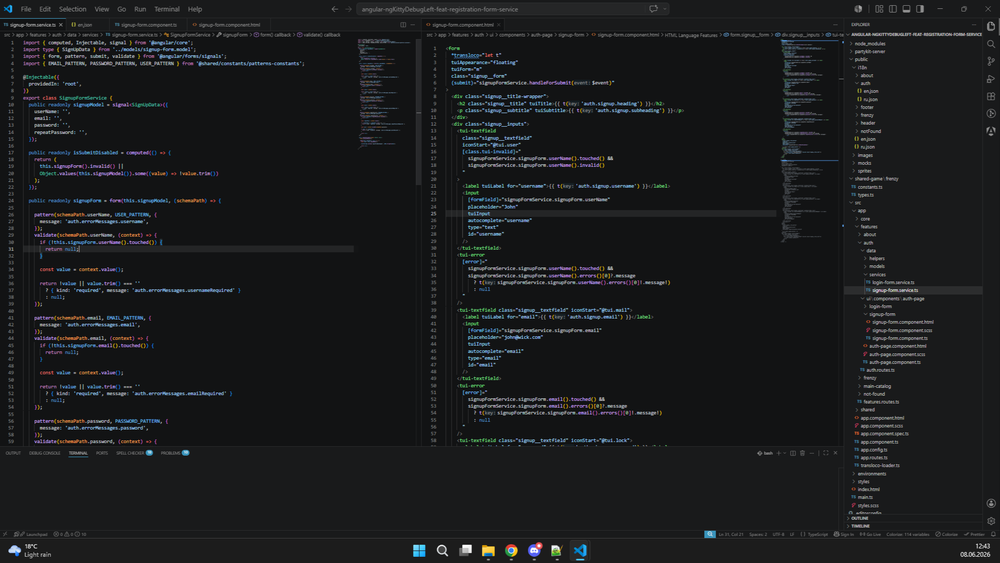
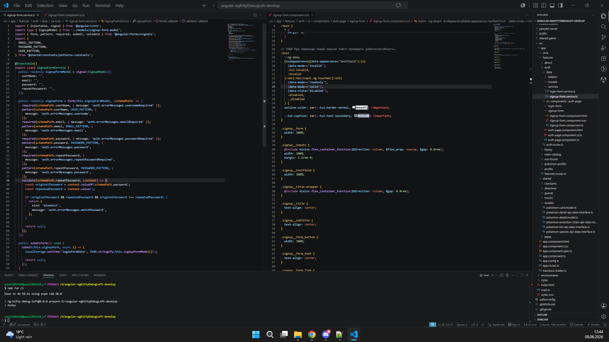

#Sprint 2: Routing & Signals - part 1 - 2026-06-08

**Что произошло**:

Пишу дневник о проделанной работе за две недели. Я думаю это будет довольно не просто сделать. Кое-что мог и позабыть, но попробую ничего не упустить. 

Первый спринт закончился на том, что я закончил делать макет страницы auth c формами логина и регистрации. Для этих страниц был настроен роутинг. 

После этого компонента решил делать карточку покемона которая находится на главной странице.
[PR#90](https://github.com/ngKittyDebug/angular-ngKittyDebugLeft/pull/90)

В первую очередь я подготовил моковые данные карточек. Сделал несколько вопрос по api и сохранил ответ в формате json. Терпения хватило на 6 начальных карточек. Не думал что ответ по каждой карточке будет настолько объемным. Не стал точно считать но точно более 1000 строк. 

После приступил к созданию карточки: накинул базовые размеры, цвет фона и базовый внешний вид. После приступил к базовому накидыванию компонентов. Для базового "скелета" выбрал связку тегов `<figure>` и `<figcaption>`. Использую ее довольно давно для такого рода компонентов. Удобно располагается родительский контейнер, само изображение и назовем его контейнер с подписью. В этом контейнере я как правило размещаю весь текстовый контент карточки. 

Сама карточка не сильно сложная по моему мнению. Обычный набор компонентов. Для повторяющихся компонентов использовал встроенный в angular встроенный шаблон для циклов `@for`. Для отображения характеристик покемона использовал как обычные числовые значения так и прогресс бар. Использовал встроенный в `Taiga UI` элемент `ProgressBar`. По началу для отображения типов покемонов использовал обычный ``, но на одном из созвонов коллеги подсказали использовать компонент из `Taiga UI` `Badge`. Для стилизации использовал обычные свойства scss и фишки, например миксины, вложенность и константы. Большинство констант было объявлено при настройке проекта.

Хотя одну вещь использовал впервые. Чтобы придать особые стили для задания разное оформления прогресс барам и баджам типов каждому элементу добавлял класс. А в стилях для предотвращения повторяемости использовал `scss` константу `list`. А далее с помощью цикла `@each` генерировал классы и стили к ним. В первый раз такое использовал. 

В компонентах для получения, передачи и вычисления некоторых значений использовал сигналы, как обычные `signal` так и вычисляемые `computed`

При ревью немного исправил некоторые ошибки и размеры карточек. Первоначальные карточки получились сильно крупными. Также удалил некоторые моковые данные. Ну скажем так переборщил с ними. Прошу прощения у тимейтов))

При ревью тимейты удивились что я использовал `<figure>` и `<figcaption>`. КЕак понял не встречали такую связку, но я думаю просто никогда не использовали ее. Уверен что такое конечно же изучали.

В общем компонент не сильно сложный. 

Далее я уже взял довольно таки большой компонент страницу профиля покемона. [PR#91](https://github.com/ngKittyDebug/angular-ngKittyDebugLeft/pull/91)
Очень хотел поработать над сложным и объемным. Для этого компонента скорректировал `issue`: добавил примерный макет, а так же основные параметры. 

Примерный макет сгенерировал с помощью ии. Использовал `Qwen 3.7`. Текст написал самостоятельно. Основная сложность была в том что точного макета не было. Примерный макет страницы, как и всего приложения был сгенерирован ранее, еще на первом этапе при разработки всего приложения тимейтом Оксаной с помощью иишки в figma. Также она вносила свои правки в дизайн. У нее хорошо получается. Я тоже решил потренироваться и на первом этапе тоже сгенерировал макет самостоятельно, но с помощью другого ресурса `https://v0.app/`. Все таки дизайном мне тоже хочется немного заниматься, но больших навыков у меня нет. Что-то по мелочи могу сделать. В итоге некоторые идеи берем с двух макетов, а стили и оформление берем из основного. Наш тимлид Алексей тоже прикладывал руку к дизайну. Сообща же идеи генерируются.

В общем компонент творческий и много чего можно было в него в пихнуть. Идеи брались с двух макетов, а также из головы.

Для компонента опять же добавил роутинг. Ничего особого. Сделал базовый компонент страницы. И потом скажем так в нее стал добавлять "виджеты" с контентом. Изначально делал все на куче. Только уже на последнем этапе их разделил на отдельные независимые компоненты. Потратил многовато времени на это. Теперь буду разрабатывать компоненты сразу правильно и разделять их чтобы потом на рефакторинг кода тратить меньше времени.
Также добавил дополнительные необходимые моковые данные. Перед пушем часть из них удалил, чтобы в репозитории не было лишнего. Они и так объемные. 

Для основной разметки использовал макет на гридах. посчитал что так будет удобнее располагать виджеты. 

Перейдем теперь к виджетам по отдельности. Как оказалась при разработке некоторых столкнулся с некоторыми проблемами. Начнем по порядку.

Первый виджет `pokemon profile info`.

По своей структуре повторяет немного карточку поекмона которую делал ранее. Практически тоже самое те же данные и принцип разработки. Только использовал для получения данных `input.required`. Также эта конструкция используется как на самой странице профиля так и на всех остальных виджет. Без данных компоненты существовать не могут))

***P.S. Отойдем от темы. Примерно на этом этапе мне нужно было писать дневник, но так как был занят некоторыми семейными делами и разработкой мало времени было на написание дневника. Авторы курса поменяли условия и дневник можно писать теперь раз в спринт. По этому я поддался и решил написать один только дневник за спринт. В данный момент вижу что это не совсем хорошая идея. Теперь много чего хочется написать. Вернемся к теме...***

В общем виджет не сильно сложный. Практически полностью повторяет карточку покемона. Разве что основные компоненты виджета расположены по горизонтали. Технологии используемые описаны были ранее. Ничего особого. Разве что на последнем этапе, при ревью, поменял стили у одной кнопки. Пойдем дальше.

Следующий виджет `pokemon profile stats`.

Тоже не сильно сложный виджет. Опять импортировал обязательные данные `input.required`, опять вычислял некоторые параметры с помощью `computed`. Для отображения характеристик покемона как обычные числовые значения так и прогресс бар. Использовал встроенный в `Taiga UI` элемент `ProgressBar`. 

Дополнительно по макетам для отображения характеристик покемона используется радарная диаграмма ну или лепестковая диаграмма. В `Taiga UI` такого компонента нет. Его конечно можно добавить с помощью сторонней библиотеки, но с совместно с Алексеем, нашим тимлидом, решил использовать что-то стандартное, наиболее подходящее по смыслу, чтобы не терять время при разработке.

***Все таки графи плотный у нас. Хотим кое-что дополнительно сделать помимо обычного Pokedexa. Но да ладно. Прошу прощения, но об этом как нибудь в другой раз расскажу. Опять отвлекся... ***

В итоге вместо радарной диаграммы использовал диаграмму `ArcChart` из `Taiga UI`. Настройка ее оказалась не сложная. Основные примеры взял на основе предложенного шаблона в документации. Хотя эта документация могла быть и получше. Пойдем дальше

Следующий виджет `evolution chain`.

Очень интересный виджет. Цепочка развития покемона. Решил использовать только текст тем более по апи можно получить только текстовые данные, а уже в них можно получить ссылки на остальных покемонов. Сделал моковые данные опять же в формате json. Так как покемоны разные и цепочка эволюции у них тоже может быть не линейная, например покемон ***eevee*** может эволюционировать в семь разных покемонов необходимо было учесть это условие. 

Данные по цепочка из апи выглядели как одна и та же карточка, которая ссылалась на такую же. В общем на рекурсию похожа. В общем в начале разработки пришлось с формировать массив данных. А уже потом под них делать компонент. Для некоторых условий, например если данные существуют, использовал использовал встроенный в angular встроенный шаблон условие `@if`. Сам компонет построил рекурсивно, где сам компонент ссылается на самого себя если в получаемых данных есть ссылка на цепочку другого покемона и так далее пока цепочка не заканчивается. Конечно при проектировании компонента использовал ии в качестве консультанта. ИИшка предлагала сделать структуру плоской, но решил оставить структуру рекурсивной. Во первых потренироваться, а во вторых чтобы связи в цепочке нарушались. Сами элементы компонента не сильно сложные. Но есть большое но. Пришли к самому интересному в виджете.

Так в цепочке для некоторых покемонов на одном из звеньев могло быть несколько разных покемонов решил их отобразить в виде карусели, где тогда отображалась бы одно карточка и при необходимости одна могла бы переключаться пользователем по кнопкам или автоматически, по таймеру. В итоге оставил два варианта. В итого решил использовать элемент из `Taiga UI` `Carousel`. Очень классный компонент. Можно настроить автоматическое переключение слайдов. Также в нем встроена поддержка свайпов на сенсорных экранах. Крутой элемент из библиотеки. НОООООООООООООО... Как же его трудно оказалась стилизовать под необходимый размер...

В документации нигде не указано что компонент `tuiCardMedium` в этой карусели, который задает размеры элементу и отчасти всему слайдеру влияет на саму работу слайдера. Если его убрать то слайдер продолжает работать, но не котором этапе слайдер прекращает работу и застревает так скажем. Я приложил очень много усилий и времени, чтобы понять что этот элемент необходим. На этом моменте додумался я своими мозгами, а не иишными)). Я попробовал использовать компонент `tuiCardSmall`. Все таки стандартные стили меня устраивали и размер тоже. Компонент `tuiCardMedium` был слишком большой по высоте и мел другой фон, который мне был не нужен. Но как оказалось компонент `tuiCardSmall` слишком маленький для карусели и карусель продолжает застревать. Наверно все таки каких то размерных стилей не хватает в нем. Разбираясь я понял что карусель работает на css анимации. 
Но опять же вернемся к документации `Taiga UI`. Где указано что компонент `tuiCardSmall` не будет подходить? Нигде. В итоге пришлось самостоятельно подправить стили компонента `tuiCardMedium`: убрал фон и изменил высоту. На этом я с каруселью закончил. Потом были некоторые правки стилей на разных этапах code review и при обновлении на новую версию `angular` и `taiga`. 

***Да во время разработки нашего проекта мы обновились сразу на новую версию angular, но об этом позже***.

***`Tandi`. Если меня услышишь, отметь что документация Taiga UI полная шляпа***.

Последний виджет на странице `pokemon profile species breeding`

Виджет не сильно сложный. Просто приходят обязательные данный и мне нужно было просто их красиво отобразить. Для корректировки отображения данных на ревью Алексей предложил написать `pipe` чтобы не вычислять значения в макете. Значения с апи приходили не в привычных нам единицах измерения. Трудностей в написании не возникло. Опять же решил использовать элементы `Badge` и `ProgressCircle`. Сама их настройка не сложная. НОООООООООООООООООООООООООООООО... 

В элементах `ProgressCircle` я использовал подписи чтобы понятно было для чего используется этот элемент. Но почему то разработчики эту обернули в тег `<label tuiProgressLabel>`. Правила eslint запрещают использовать тег `<label>` без привязки к элементу формы. И опять об этом нигде в документации не написано. И почему использовали тег `<label>`, а не любой другой строчный, например ``? В общем мне это не понятно. Обошел я это уже на опыте. Скопировал стили элемента `ProgressCircle` и применил к своим тегам которые поменял чтобы линтер не ругался. Правила решил не отключать.

P.S. Тут я добавил кастомные курсоры которые работают в приложении. Приколюха зашла. Я рад.

***`Tandi`. Если меня услышишь, отметь что некоторые компоненты Taiga UI разработаны без учета правил линтеров***.

Теперь у нас на проект вернулся старый друг `Клавдий` иишная встройка в репозиторий. Он проверяет наши pr и тыкает носом в каки которые наделали. Я очень рад этому. Все же мы только учимся и все можем не увидеть. А `Клавдий` более внимателен и уровень просмотра у него намного шире. По крайней мере чем мой так точно. Он мне натыкал на ошибки в компоненте. На мое удивление их было не слишком много. Все же чему то научился)) Очень приятно.

Вышел Angular 22 версии. Мы сразу решили мигрировать на него. Также обновили и Тайнгу. С миграцией возникли некоторые трудности, возникали непонятные merge-конфликты, но Алексей просто бог и мне помог.

***Огромное спасибо Сасарику за Клавдия***.

Едем дальше. Последний компонент. Эта сервис для формы регистрации. [PR#125](https://github.com/ngKittyDebug/angular-ngKittyDebugLeft/pull/125)
Как же я хотел поработать с формами и валидацией и разобраться как правильно делать такую штуку. И раз Angular обновился до 22 версии и появились в нем сигнальные формы Алексей предложил написать сервис на них.Тем более кураторы курса сказали что можно использовать новые фишки Angulara. Сервис на реактивных формах он уже написал. Я согласился. Но была оговорка если будет не получатся и буду тратить много времени, то сервис пишу на реактивных формах. Но наверное никто из нашей команды не знаю, что я "упорант" и я до последнего буду долбать идею если она мне зашла.

Перед началом проектирования сервиса. Я изучил документацию. Читал ее как на английском, так и на русском языке посредством встроеного переводчика в браузер. Дока супер. Ни в какое сравнение с докой от `Тайги`. 

***`Tandi`. Если меня услышишь, отметь что документация Angular топ. Понятная и объемная. Доке Taiga UI до нее очень далек***.

Немного теории. (Signal Forms) в Angular — это принципиально новая подсистема для работы с формами, которая полностью отказывается от старой архитектуры (FormControl, FormGroup, RxJS-подписок) в пользу нативной реактивности сигналов. Форма больше не строится вручную через абстрактные классы — она автоматически генерируется на основе модели данных которую я сделал. Всего четыре поля: логин или имя пользователя, email, пароль и поле для повторения пароля.
Сначала создал модель `(Signal)` в которой хранится модель формы в виде объекта с полями и их значениями. Потом инициализировал ее с помощью функции `form()`. В нее передал в нее сам сигнал и `schemaPath`. `SchemaPath` скажем так путеводитель по форме в которой для каждого поля описываются правила и функции валидации. Все они подробно описаны в документации. А потом связал форму в шаблоне новой директивой `[field]`.
А отправляется форма уже обычным способом.
Сам сервис инжектил в компонент с формой регистрации

Написать сам сервис было не сложно. Документация понятная и подробная. Также Алексей уже написал паттерны для проверки, которые я использовал.
Сама сложность была интегрировать сам сервис в моей компонент формы. `Taiga UI` на данный момент не поддерживает `signal form`. И многие директивы которые используются элементами формы не работают. В директиве `[field]` под капотом наверное зашит запрет на использование директив, например `[valid]` и тому подобных. Все зашито в [field] и необходимо доставать от туда. 

Вся проблема крылась в том что при загрузке форма отображалась сразу не валидной потому что все поля пустые, а все поля в моей форме обязательны для заполнения. Форма думает что она пустая, соответственно не валидная и отображалась так же еще до вмешательства пользователя. Мне надо было как-то заставить поля формы отображаться по логике верн: если пользователь не нажимал на поле ввода, то считать его валидным, а вот если уже касался пользователь поля ввода, то считать не валидным. По умолчанию в компонент поля ввода можно передать функцию в директиву `[valid]`. Примерно так работает с реактивными формами. Но это уже не мой случай. Описал немного выше. Пришлось думать как могу я это обойти.
А итоге в `schemaPath` добавил инструмент `validate()` в котором описал правила валидации для свое случая. Если пользователь еще не касался поля ввода, то считать его валидным, а вот если уже касался и поле обязательное для заполнения то делать невалидным. Для кнопки пришлось дописывать функцию, которая проверяла пустые ли поля и в зависимости от этого блокировала кнопку отправки формы. Форма в таком случае работал сервис был написан. Результатом удовлетворен. И до этого я додумался сам, своими мозгами.
 

Но мне этого было мало. Мне не понравилось что я использовал инструмент `validate`. Хотелось использовать нативный инструмент `required`, потому как внешний вид `schemaPath` мне не понравился слишком громоздко и есть дополнительная функция для кнопки. Захотел написать чище. Стал копать. Стал общаться с иишкой. Платной у меня нет. `Qwen 3.7` хоть и относительно не плох, но `signal forms` можно сказать что не знает. Пришлось вести общение со встроенным ии-агентом в google. Как раньше говорилось google знает все, так оказалось и в этот раз. Иишка хоть и говорила что `signal forms` это только экспериментальная возможность, но отвечала правильно. И ведя с ней диалог изучал предложенные варианты. Было очень много вариантов. Все не буду описывать. Даже был вариант с использованием директивы. ССылка на этот вариант вела на issue которые был описан как раз в репозитории самого angular)). У меня не получилось разобраться с ним. В одном из запросов ишшка предложила копать в сторону классов `Taiga UI`. ИИшка предложила вставить в `app.config` `provideSignalFormsConfig` и описать правила подмены селекторов. Правила эти я просто скопировал из ответа и стал тогда смотреть в сторону селектора поля ввода. Он ооочень длинный и безобразный. И применив к нему другой стиль outlina я добился нужного результата. 
 

Я имел на руках чистый сервис на `angular signals`, как по документации. Исправлялся только селектор и правился app.config. С этим я вызвал тимейтов и других колег. Я топил за этот вариант как наиболее чистый. По началу все так и посчитали. На половину навайбкоденый вариант казался потрясающим. Думал что прыгнул выше головы. Но по разбиравшись с тем что происходит что это не совсем хороший вариант и в случае выхода новой версии тайги все могло поломаться. Но решили оставить второй вариант и он запушился в проект. Были конечно правки про code review, но это уже не совсем существенно. 

**Результат**:

Победа, но у меня послевкусие не очень

**Вывод:** 

Итог у меня такой, что не стоит использовать новую фичу фреймворка если она полностью не поддерживается библиотекой. Получилось написать можно сказать два варианта сервиса. Но все они с большими компромиссами. По итогу если бы писал сервис по работе с формами с использованием реактивных форм справился бы гораздо быстрее. Код надежнее и трудозатрат меньше. К этому я не совсем готов. Мне все же жалко свой труд и время. И психологически не много выбивают из колеи потерянное время и труд, из-за непонятной документации, из-за неадекватно написанных компонентов и из-за желания воспользоваться новой фичей. Наверное я был к этому не готов. 

Но результат положительный: компоненты готовы и они работают. В общем не важно как это сделано. Результат есть 

**Планы:** 

Бужу продолжать работу над компонентами. Есть что улучшать. Например хочу все таки вставить радарную диаграмму. Также с после беседы с Алексеем пришел к выводу что нужно отрефакторить сервис по работе с формой и вернуть свое первое решение. Также можно будет заняться правками ошибок, которые нашел Клавдий. И на горизонте маячит тема ради которой мы и взяли тему покемонов. Продолжаем работу.

**Потраченное время** 

Время опять писать не буду. На правку карусели в цепочке эволюции потратил около 6 часов. На разработку сервиса по работе с формой регистрации на сигнальных формах потратил около 7-8 часов. На остальные компоненты точно уже не считал.

P.S. Простите за длинный дневник. Как-нибудь в другой раз напишу короче