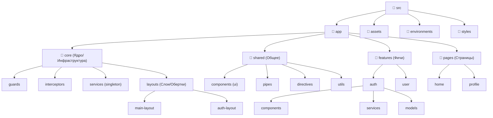

# Архитектура и структура папок проекта (Angular 21)

В этом проекте мы придерживаемся модульного подхода (основанного на Feature-Sliced Design). Наша цель — сделать так, чтобы проект был масштабируемым. Если в проект придет новый разработчик, он должен интуитивно понимать, где лежит нужный код, а удаление старой "фичи" (например, модуля оплаты) не должно ломать остальное приложение.

## Общая диаграмма структуры



---

## 🏗 Общая концепция "На пальцах"

Чтобы понять нашу архитектуру, представьте сборку автомобиля на заводе:

1. **`shared/` (Болты, гайки, кнопки)** — базовые, универсальные детали. Гайка не знает, куда её закрутят — в двигатель или в колесо.
2. **`features/` (Сложные агрегаты: Двигатель, Руль)** — готовые блоки с бизнес-логикой. Двигатель сам качает топливо и крутится, но не знает, в какую модель машины его поставят.
3. **`core/layouts/` (Кузов автомобиля)** — оболочка, в которую будут вставляться агрегаты.
4. **`pages/` (Сборочный цех)** — конкретная модель автомобиля (страница по URL). Сборочный цех берет Кузов (`layouts`), кладет в него Двигатель (`features/engine`), прикручивает Колеса (`features/wheels`) с помощью Гаек (`shared/ui`).

---

## 📂 Разбор слоев: Для чего нужны и как использовать (Angular 21)

### 1. `shared/` (Переиспользуемый UI-Kit и Утилиты)

**🤔 Какую проблему решает?**
Предотвращает дублирование кода. Если в приложении 50 разных кнопок, инпутов или карточек, мы пишем их один раз в `shared`.

**🚨 Главное правило:**
Этот слой абсолютно "глупый". Он **не имеет права** делать запросы на бекенд, ничего не знает о пользователях, товарах или роутинге. Он только принимает данные (через `input`) и отдает события (через `output`).

**Где лежит:** `src/app/shared/components/ui-button/`

**💻 Пример кода (Angular 21):**

```typescript
import { Component, input, output } from '@angular/core';
import { NgClass } from '@angular/common';

@Component({
  selector: 'app-ui-button',
  standalone: true,
  imports: [NgClass],
  template: `
    <button
      [class.primary]="color() === 'primary'"
      [disabled]="isDisabled()"
      (click)="clicked.emit()"
    >
      <!-- Контент пробрасывается извне (ng-content) -->
      <ng-content></ng-content>
    </button>
  `,
})
export class UiButtonComponent {
  // Новые Signal Inputs
  public readonly color = input<'primary' | 'secondary'>('primary');
  public readonly isDisabled = input<boolean>(false);

  // Новый Signal Output
  public readonly clicked = output<void>();
}
```

---

### 2. `features/` (Бизнес-фичи / Сущности)

**🤔 Какую проблему решает?**
Инкапсуляция (изоляция) бизнес-логики. Раньше логику размазывали по всей странице. Теперь, если у нас есть "Корзина", мы создаем `features/cart`. Там лежат сервисы для загрузки товаров из API, стейт корзины и умный виджет корзины. Если бизнес скажет "уберите корзину", мы просто удаляем папку `features/cart`, и проект не ломается.

**🚨 Главное правило:**
Фичи — это "умные" блоки. Они сами ходят на сервер. Но они **ничего не знают про URL-адреса и страницы**. Один виджет корзины можно вставить на 10 разных страниц. Фича может импортировать `shared`.

**Где лежит:** `src/app/features/cart/`

**💻 Пример кода (Angular 21):**
Сначала Сервис (стейт и API с использованием нового `resource`):

```typescript
// features/cart/services/cart.service.ts
import { Injectable, resource, signal } from '@angular/core';
import { inject } from '@angular/core';
import { HttpClient } from '@angular/common/http';

@Injectable({ providedIn: 'root' })
export class CartService {
  private readonly http = inject(HttpClient);
  public readonly userId = signal<number | null>(1); // Пример

  // Resource API (Angualar 19+) - сам обрабатывает loading, data, error
  public readonly cartResource = resource({
    request: this.userId,
    loader: ({ request }) => fetch(`/api/cart/${request}`).then((res) => res.json()),
  });

  public clearCart(): void {
    // логика очистки
  }
}
```

Затем Умный компонент (Виджет):

```typescript
// features/cart/components/cart-widget.component.ts
import { Component, inject } from '@angular/core';
import { CartService } from '../services/cart.service';
import { UiButtonComponent } from '../../../shared/components/ui-button/ui-button.component';

@Component({
  selector: 'app-cart-widget',
  standalone: true,
  imports: [UiButtonComponent],
  template: `
    <div class="widget">
      <!-- Использование нового Control Flow и Resource API -->
      @if (cart.cartResource.isLoading()) {
        <p>Загрузка корзины...</p>
      } @else if (cart.cartResource.error()) {
        <p class="error">Ошибка загрузки</p>
      } @else {
        <h3>Товаров: {{ cart.cartResource.value()?.itemsCount }}</h3>
        <app-ui-button (clicked)="cart.clearCart()">Очистить</app-ui-button>
      }
    </div>
  `,
})
export class CartWidgetComponent {
  // Внедрение зависимости через современный inject()
  protected readonly cart = inject(CartService);
}
```

---

### 3. `pages/` (Слой маршрутизации / Сборочный цех)

**🤔 Какую проблему решает?**
Связывает бизнес-блоки (`features`) с конкретным URL (например, `/checkout`).

**🚨 Главное правило:**
Страницы — это "клей". Страница **не должна** сама делать HTTP-запросы за товарами (для этого есть фичи). Её единственная задача — сказать: _"Окей, юзер зашел на `/checkout`. Я нарисую сетку из двух колонок. Слева вставлю форму оплаты (`features/payment`), справа вставлю корзину (`features/cart`)."_

**Где лежит:** `src/app/pages/checkout/`

**💻 Пример кода (Angular 21):**

```typescript
import { Component } from '@angular/core';
// Импортируем готовые "агрегаты" из features
import { CartWidgetComponent } from '../../features/cart/components/cart-widget.component';
import { PaymentFormComponent } from '../../features/payment/components/payment-form.component';

@Component({
  selector: 'app-checkout-page',
  standalone: true,
  // Регистрируем фичи для использования на странице
  imports: [CartWidgetComponent, PaymentFormComponent],
  template: `
    <main class="page-container">
      <h1>Оформление заказа</h1>

      <div class="grid-2-cols">
        <!-- Расставляем фичи по местам -->
        <section class="left">
          <app-payment-form />
        </section>

        <section class="right">
          <app-cart-widget />
        </section>
      </div>
    </main>
  `,
})
export class CheckoutPageComponent {}
```

---

### 4. `core/` (Ядро и Инфраструктура)

**🤔 Какую проблему решает?**
Хранит всё то, что обеспечивает работу приложения "под капотом", но не является бизнес-фичей. Здесь лежат настройки сети (Интерцепторы), защита роутов (Гарды) и макеты страниц (`layouts`).

**🚨 Главное правило:**
Никакой UI-компонент не должен импортировать ничего из `core` (кроме глобальных синглтон-сервисов вроде `AuthService`). `core` нужен приложению при старте.

#### Вложенный слой: `core/layouts/` (Обертки)

Макеты задают глобальную сетку (Навигация сверху, Футер снизу, Контент посередине).

**💻 Пример кода (Angular 21):**

```typescript
// core/layouts/main-layout.component.ts
import { Component } from '@angular/core';
import { RouterOutlet } from '@angular/router';
// Layout может импортировать виджеты из features для хедера (например, профиль юзера)
import { UserProfileWidgetComponent } from '../../features/user/components/user-profile-widget.component';

@Component({
  selector: 'app-main-layout',
  standalone: true,
  imports: [RouterOutlet, UserProfileWidgetComponent],
  template: `
    <header>
      <div class="logo">My App</div>
      <app-user-profile-widget />
      <!-- Виджет из features -->
    </header>

    <!-- Сюда Angular динамически подставит нужную Page в зависимости от URL -->
    <main class="content">
      <router-outlet></router-outlet>
    </main>

    <footer>© 2026 Все права защищены</footer>
  `,
})
export class MainLayoutComponent {}
```

---

## 🧭 Резюме правил импорта (Зависимости)

Чтобы код не превратился в спагетти, соблюдайте строгий однонаправленный поток:

1. **`shared`** — самый нижний слой. Может импортировать только из самого себя.
2. **`features`** — средний слой. Могут импортировать `shared` и другие `features` (по необходимости). Не знают про `pages`.
3. **`pages`** — верхний слой. Импортируют `features` и `shared`, чтобы собрать страницу.
4. **`core`** — системный слой. Самодостаточен. Макеты (`layouts`) могут использовать `features` и `shared`.

**Как добавить новое? Чек-лист:**

- Нужна базовая красивая кнопочка без логики? 👉 **`shared/`**
- Нужно написать логику запроса профиля с сервера? 👉 **`features/user/`**
- Нужно собрать экран "Настройки", чтобы туда заходили по ссылке `/settings`? 👉 **`pages/settings/`**
- Нужно добавить глобальную обработку 401 ошибки сети? 👉 **`core/interceptors/`**
- Нужно добавить боковое меню, которое видно на всем сайте? 👉 **`core/layouts/`**
